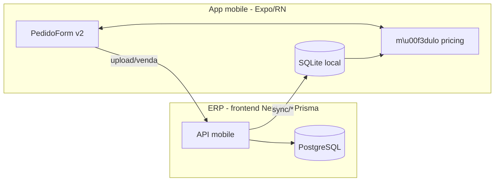

# Plano: Regras de pre\u00e7o/impostos legado no TechBull Mobile

## Decis\u00f5es j\u00e1 alinhadas
- Escopo fase 1: **tudo** (pre\u00e7o base + promo\u00e7\u00e3o + cr\u00e9dito ST + IPI + ST + FCP + desconto por faixa + condi\u00e7\u00e3o de pre\u00e7o + condi\u00e7\u00e3o de pagamento + \u00faltima venda + Flex + margem + motor de f\u00f3rmula).
- Tabela de pre\u00e7o: default vem de `Configuracao.cdTabelaPreco`, mas o vendedor pode trocar na tela do pedido (picker).
- Par\u00e2metros de neg\u00f3cio: tabela nova `ConfiguracaoVendaMobile` por holding+empresa, com colunas tipadas e **default em todas**.
- Flex: novo campo `cdRepresentante` opcional no `User` + reuso do `Representante` + novos modelos `RepresentanteSaldoFlex` e `FlexMovto`.
- \u201c\u00daltima Venda\u201d: identificada por **par\u00e2metro** em `ConfiguracaoVendaMobile.cdCondicaoPrecoUltimaVenda` (FK opcional para `CondicaoPreco`).
- Motor de f\u00f3rmula por empresa: express\u00e3o texto avaliada em sandbox com `mathjs`.
- Retrocompat: quando `ConfiguracaoVendaMobile` n\u00e3o existe para a empresa, o app cai no fluxo atual (pipeline desligado).

## Arquitetura em alto n\u00edvel



## 1. Schema Prisma (ERP) \u2014 `prisma/schema.prisma`
Todas as colunas novas ganham `@default(...)` para n\u00e3o quebrar writes existentes.

### 1.1 Tabelas completamente novas
- **`ImpostoUf`** (PK `cdImposto + cdEstado`): `prIcmsInterno`, `prIcmsExterno`, `prBaseSubstituicaoInterno`, `prBaseSubstituicaoExterno`, `prReducaoBaseSubstituicaoInterno/Externo`, `prReducaoIcmsInterno`, `prPis`, `prCofins`, `prFcpInterno`, `prFcpExterno`, `idStDiferencaIcms Boolean @default(false)`.
- **`ProdutoDesconto`** (PK `cdProduto + holdingId + qtProdutoInicio`): faixa de quantidade (`qtProdutoInicio`, `qtProdutoFim`, `prDesconto`).
- **`CondicaoPagtoPreco`** (PK `cdCondicaoPagto + cdCondicaoPreco + holdingId`): vincula condi\u00e7\u00e3o de pagamento a cen\u00e1rios de pre\u00e7o.
- **`RepresentanteSaldoFlex`** (PK `cdRepresentante + holdingId`): `vlSaldoFlex Decimal @default(0)`.
- **`FlexMovto`**: hist\u00f3rico de movimenta\u00e7\u00e3o (cr\u00e9dito/d\u00e9bito) por pr\u00e9-venda.
- **`ProdutoCustoVariavel`** (PK `cdEmpresa + holdingId + cdVariavel`): vari\u00e1veis nomeadas usadas no motor de f\u00f3rmula.
- **`ConfiguracaoVendaMobile`** (PK `holdingId + cdEmpresa`) com **todas** as flags legado, todas com default seguro (mesmo valor que hoje \u00e9 impl\u00edcito no app atual):
  - `nrCasaDecimalValorVenda Int @default(2)`
  - `nrCasaDecimalQuantidade Int @default(2)`
  - `idProdutoControleVariacaoPreco Char(1) @default("N")` (`M` margem, `D` desconto, `N` nenhum)
  - `prMargemMinimo Decimal @default(0)`
  - `idUtilizaDescontoPromocaoPedidoVenda Boolean @default(false)`
  - `idUtilizaPromocaoPorTabelaPreco Boolean @default(false)`
  - `idUtilizaCondicaoPagtoLigacaoCondicaoPreco Boolean @default(false)`
  - `idUtilizaDescontoCreditoSubstituicaoVenda Boolean @default(false)`
  - `idEmpresaUtilizaAcrescimoCondicaoPagto Boolean @default(true)`
  - `idBloqueiaAlteracaoPrecoTablet Boolean @default(false)`
  - `idIgnoraTabelaPrecoClienteTablet Boolean @default(false)`
  - `idDestacaIpi Boolean @default(false)`
  - `idSubstitutoTributarioIcms Boolean @default(false)`
  - `idCalculaSubstituicaoTributariaSempre Boolean @default(false)`
  - `idRegimeUtilizaReducaoBaseSubstituicao Boolean @default(false)`
  - `prIcmsProdutoImportadoCompraVendaForaEstado Decimal @default(0)`
  - `idUtilizaStDiferencaIcms Boolean @default(false)`
  - `idUtilizaMvaExternoVenda Boolean @default(false)`
  - `idUtilizaFcp Boolean @default(false)`
  - `idUtilizaReducaoIcmsForaEstado Boolean @default(false)`
  - `idTipoComissaoVenda Char(1) @default("B")`
  - `cdCondicaoPrecoUltimaVenda Int?` (FK para `CondicaoPreco`)
  - `dsFuncaoCalculoPrecoVenda String?` (express\u00e3o mathjs)
  - `dsFuncaoCalculoMargemLucro String?`
  - `cdTabelaPrecoPadrao Int?` (fallback se n\u00e3o houver em `Configuracao`)
  - `cdCondicaoPrecoPadrao Int?`

### 1.2 Colunas novas em modelos existentes (todas com default)
- **`Produto`**: `prIpi Decimal @default(0)`, `cdImposto Int @default(0)`, `idOrigemProduto Char(1) @default("0")`, `vlCreditoSubstituicao Decimal @default(0)`, `idGeraFlex Char(1) @default("S")`.
- **`CondicaoPreco`**: (sem flag `idUltimaVenda` \u2014 a identifica\u00e7\u00e3o vem de `ConfiguracaoVendaMobile.cdCondicaoPrecoUltimaVenda`).
- **`User`**: `cdRepresentante Int?` (FK opcional para `Representante`), `prFlexMin Decimal @default(-100)`, `prFlexMax Decimal @default(100)`, `idMargem Char(1) @default("N")`.
- **`Prevenda`**: `vlIpiTotal Decimal @default(0)`, `vlSubstituicaoTotal Decimal @default(0)`, `vlFlex Decimal @default(0)`, `vlDescontoCreditoSubstituicao Decimal @default(0)`, `cdTabelaPreco Int?`, `cdCondicaoPreco Int?`.
- **`PrevendaItem`**: `prDesconto1 Decimal @default(0)`, `prDesconto2 Decimal @default(0)`, `vlIpi Decimal @default(0)`, `vlSubstituicao Decimal @default(0)`, `vlFlex Decimal @default(0)`, `vlDescontoCreditoSubstituicao Decimal @default(0)`, `cdTabelaPrecoCondicao Int?`.

> Migra\u00e7\u00e3o gerada com `prisma migrate dev --create-only` para revisar SQL antes de rodar; todas as colunas novas t\u00eam default, nenhum backfill obrigat\u00f3rio.

## 2. API mobile (Next.js pages) \u2014 `src/pages/api/mobile/`

### 2.1 Novos endpoints de sync
Todos seguem o mesmo padr\u00e3o de `sync/tabela-preco.ts` (`createMobileRoute` + `prisma.findMany`):
- `sync/imposto-uf.ts`
- `sync/tabela-icms.ts` (j\u00e1 existe modelo Prisma \u2014 s\u00f3 n\u00e3o sincroniza hoje)
- `sync/tabela-preco-item.ts` (paginado, retorna `cdTabelaPreco + cdProduto`)
- `sync/produto-desconto.ts`
- `sync/condicao-pagto-preco.ts`
- `sync/representante.ts` (Flex: saldo + limites do `User` relacionado)
- `sync/produto-custo-variavel.ts`
- `sync/configuracao-venda-mobile.ts` (retorna a linha da empresa do login + flags consolidadas)

### 2.2 Ajuste em endpoints existentes
- `sync/produto.ts`: incluir no `select` os campos fiscais novos (`prIpi`, `cdImposto`, `idOrigemProduto`, `vlCreditoSubstituicao`, `idGeraFlex`) al\u00e9m do `tabelaPrecoItem` que j\u00e1 existe (manter `dtPromocaoInicio/Fim` j\u00e1 retornados).
- `sync/condicao-preco.ts`: sem mudan\u00e7a de schema, j\u00e1 est\u00e1 ok.
- `sync/cidade.ts`: garantir que `cdEstado` j\u00e1 \u00e9 entregue (para origem/destino de ICMS).
- `upload/venda.ts`: aceitar novos campos opcionais na raiz da `Prevenda` (`vlIpiTotal`, `vlSubstituicaoTotal`, `vlFlex`, `vlDescontoCreditoSubstituicao`, `cdTabelaPreco`, `cdCondicaoPreco`) e em cada `PrevendaItem` (`vlIpi`, `vlSubstituicao`, `vlFlex`, `vlDescontoCreditoSubstituicao`, `prDesconto1`, `prDesconto2`, `cdTabelaPrecoCondicao`). Como tudo tem default no Prisma, payloads antigos continuam funcionando.
- Tratamento do Flex: se payload vier com `vlFlex` e o User tiver `cdRepresentante`, gravar `FlexMovto` e atualizar `RepresentanteSaldoFlex` dentro da mesma transa\u00e7\u00e3o.

### 2.3 `meta` (hidrata\u00e7\u00e3o)
`api/mobile/meta/index.ts` passa a devolver tamb\u00e9m:
- `configuracaoVendaMobile` (todos os flags j\u00e1 com defaults)
- `representanteFlex` (saldo/min/max) se o User tiver `cdRepresentante`.

## 3. App mobile (Expo/RN)

### 3.1 Migra\u00e7\u00f5es SQLite \u2014 `app/src/db/migrations.ts`
Adicionar, idempotentes, ao final de `runMigrations` (ap\u00f3s `ensureColumn`):
- Colunas novas em `produto`: `pr_ipi`, `cd_imposto`, `id_origem_produto`, `vl_credito_substituicao`, `id_gera_flex`, `cd_classificacao_fiscal`.
- Novas tabelas: `tabela_preco_item`, `imposto_uf`, `tabela_icms`, `produto_desconto`, `condicao_pagto_preco`, `representante`, `representante_saldo_flex`, `flex_movto`, `produto_custo_variavel`, `configuracao_venda_mobile`.

### 3.2 Reposit\u00f3rios \u2014 `app/src/db/repositories/`
- `bulkInsertProdutos` passa a gravar campos fiscais; manter gera\u00e7\u00e3o de `vl_venda` do primeiro `tabelaPrecoItem` para n\u00e3o quebrar telas atuais.
- Novo `tabelaPrecoItem.ts` (pre\u00e7o por `(cdTabelaPreco, cdProduto)`).
- Novos `impostos.ts`, `produtoDesconto.ts`, `configVendaMobile.ts`, `representanteFlex.ts`.
- `outbox.ts` passa a serializar os campos extras no `payload`.

### 3.3 M\u00f3dulo novo \u2014 `app/src/pricing/`
Fun\u00e7\u00f5es puras, sem depend\u00eancia de UI, testadas em isolamento:

```text
src/pricing/
  index.ts            // API p\u00fablica (calcularPrecoItem, calcularTotais)
  precoBase.ts        // tabela de pre\u00e7o + promocao (Se\u00e7\u00e3o 2.2 do doc legado)
  descontos.ts        // faixa de quantidade, cr\u00e9dito ST, cond. pre\u00e7o, cond. pagto
  imposto.ts          // IPI (Se\u00e7\u00e3o 3.1)
  icms.ts             // f_calcula_imposto_busca_aliquota (Se\u00e7\u00e3o 3.2)
  substituicao.ts     // calcula_substituicao2 (Se\u00e7\u00e3o 3.3) + FCP
  flex.ts             // atualizaFLEX + FLEX_validacao + variacao_preco_validacao
  formula.ts          // sandbox mathjs (vari\u00e1veis nomeadas de produto_custo_variavel)
  arredondamento.ts   // round pelas casas decimais da configura\u00e7\u00e3o
  types.ts            // PricingInput, PricingResult, PricingContext
```

Entrada \u00fanica:
```ts
calcularPrecoItem({ produto, tabelaPrecoItem, condicaoPreco, condicaoPagto, cliente, empresa, qtPedida, config, custosVariaveis }): {
  vlUnitario, vlIpi, vlSubstituicao, vlFcp, vlCreditoSubstituicao, pr1, pr2, debug
}
```

Segue a ordem do pipeline canon\u00f4nico do [docs/regras-de-negocio-legado.md](docs/regras-de-negocio-legado.md) se\u00e7\u00e3o 2.2, lendo as flags do `ConfiguracaoVendaMobile`.

### 3.4 Sync \u2014 `app/src/sync/entities.ts`
Adicionar novas `SyncEntityDef`s na ordem correta de depend\u00eancia (antes de `produto`): `configuracao-venda-mobile`, `imposto-uf`, `tabela-icms`, `representante`, `produto-custo-variavel`, `tabela-preco-item`, `produto-desconto`, `condicao-pagto-preco`.

### 3.5 Tela do pedido \u2014 `app/src/components/PedidoForm.tsx`
Estrat\u00e9gia **feature flag** (preserva fluxo atual at\u00e9 a config chegar):
1. Carrega `ConfiguracaoVendaMobile` no in\u00edcio. Se n\u00e3o existir \u2192 render atual (path antigo).
2. Se existir:
   - Adicionar picker `TabelaPrecoPicker` (pr\u00e9-selecionado em `Configuracao.cdTabelaPreco` ou `cdTabelaPrecoPadrao`).
   - Adicionar picker `CondicaoPrecoPicker`.
   - Recalcular `vlUnitario`, `vlIpi`, `vlSubstituicao` por item sempre que quantidade/condi\u00e7\u00e3o/tabela mudarem, chamando `calcularPrecoItem`.
   - Card de totais passa a mostrar Subtotal, IPI (se `idDestacaIpi`), ST, FCP, Flex consumido e Total.
   - Valida\u00e7\u00e3o Flex acontece no `salvar()` (bloqueia ou mostra erro conforme `FLEX_validacao`).
3. Campo de pre\u00e7o manual \u00e9 somente leitura quando `idBloqueiaAlteracaoPrecoTablet = true`.

### 3.6 Payload do upload
`PedidoForm.salvar()` passa a incluir os novos campos no `uploadPayload` (ainda compat\u00edvel porque todos s\u00e3o opcionais no endpoint).

## 4. Testes e seguran\u00e7a
- Suite de testes unit\u00e1rios (Jest via `npm test` no app) para `src/pricing/*` cobrindo:
  - 8 cen\u00e1rios do pseudoc\u00f3digo legado (2.4): base; promo com/sem tabela; acr\u00e9scimo cond. pre\u00e7o; desconto cond. pagto condicional; desconto por faixa; \u00faltima venda; f\u00f3rmula din\u00e2mica; ST interno x externo, com/sem MVA externo, com/sem FCP; Flex dentro/fora da faixa.
- Motor de f\u00f3rmula (`formula.ts`): `mathjs` com `evaluate` em escopo vazio, permitindo apenas vari\u00e1veis nomeadas (lista branca passada expl\u00edcita).
- Nenhuma concatena\u00e7\u00e3o din\u00e2mica de SQL no app (o legado fazia; aqui s\u00e3o lookups tipados).

## 5. Rollout seguro (n\u00e3o quebra hoje)
1. Aplicar migrations no ERP (s\u00f3 colunas com default + tabelas novas vazias) \u2192 deploy.
2. Publicar endpoints de sync/upload atualizados \u2192 deploy (payloads antigos continuam aceitos).
3. App mobile com a flag: enquanto n\u00e3o houver `ConfiguracaoVendaMobile` cadastrada, comportamento atual.
4. Configurar uma empresa piloto com `ConfiguracaoVendaMobile` e alimentar `ImpostoUf`/`TabelaIcms`/`ProdutoDesconto`.
5. Buscar Informa\u00e7\u00f5es no app \u2192 pipeline entra em cena somente para aquela empresa.

## 6. Itens fora do escopo (propostos para fase seguinte)
- CRUDs administrativos no backoffice web para os novos cadastros (`ImpostoUf`, `ProdutoDesconto`, `ConfiguracaoVendaMobile`, `RepresentanteSaldoFlex`). Pode ser feito depois do pipeline validar.
- Relat\u00f3rios/auditoria de consumo de Flex.
- Reescrita das variantes legadas `f_calcula_substituicao` / modelo01 \u2014 usamos apenas `calcula_substituicao2`.